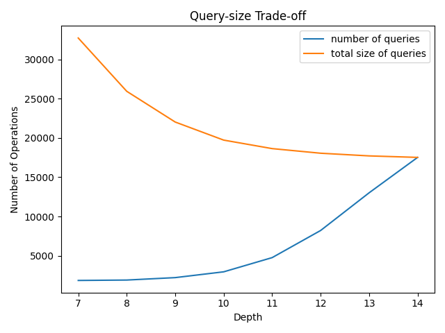
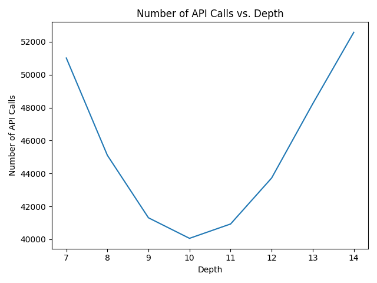
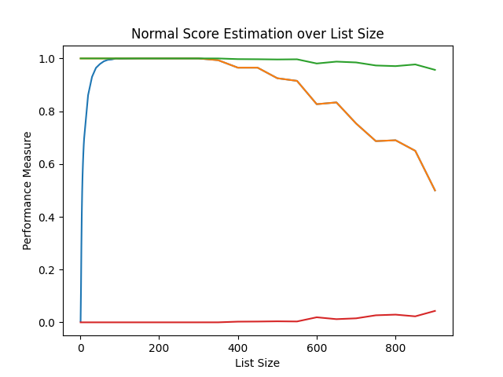
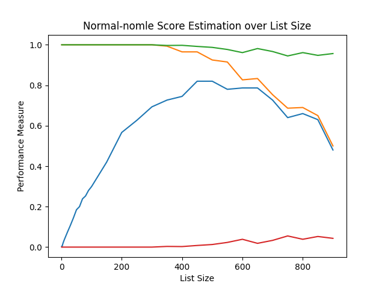
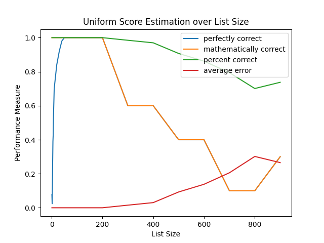
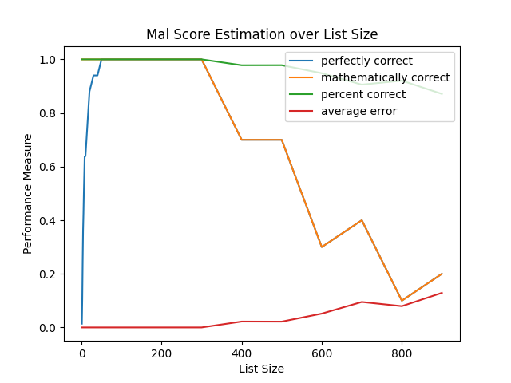

## _An Efficient Privacy Attack on MyAnimeList's Affinity Oracle_

Abstract: Even for private lists [MyAnimeList](https://myanimelist.net/) (MAL)
computes similarity statistics between the private user and the current user
(the number of shared anime and the Pearson's correlation between the lists).
Can this information be abused to discover the contents of the private list?
The answer is an definitive yes. The anime in a private list can be determined
in _O(M_ log _N)_ queries if _N_ is the number of anime in the entire database
and _M_ is the size of the list, and at worst _O(N)_ API operations. Once the
anime in a private list is determined, the scores the user rated each anime
can be computed in at most _M_ - 1 queries and _O(M)_ time. Thus, it is both
computationally efficient and practical to determine the entirety of a private
list with only publicly accessible information.

Recommendations: Don't compute the number of shared anime or the
affinity for users who make their lists private. When sharing aggregate
user data for scientific purposes, consider looking into [differential
privacy](https://www.cis.upenn.edu/~aaroth/Papers/privacybook.pdf).

- [`attack.py`](./attack.py): an implementation of both parts of the attack.
- [`query.py`](./query.py): responds to queries posed by `attack.py`.
- [`gen_test_data.py`](./gen_test_data.py): generates the
database of possible anime and the particular private list.
- [`stats.py`](./stats.py): computes the expected performance of the attack 

Helper files:
- [`archive.py`](./archive.py): unused code
- [`kmeans.py`](./kmeans.py): 1D _k_-means implementation
- [`prob.py`](./prob.py): helper library for probabilistic analysis 

## Determining List Contents

Suppose we have a set of _N_ possible anime (the universe of all
possible anime) and _M_ anime in the private list. We show how
to efficiently determine which anime are in the private list.

### Naive Algorithm

Suppose we want to know whether anime _i_ is in the private list. We can simply
add _i_ to our (initially empty) list and then check how many anime are shared.
If there is 1 anime shared we know _i_ is in the user's list and if there are
no anime shared we know _i_ isn't in the user's list. If we check this for each
possible anime, we have a simple _O(N)_ brute force algorithm.

At this time there appears to be only [17,500 total
anime](https://myanimelist.net/topanime.php?type=bypopularity&limit=17500)
which is certainly reasonable to brute force.

However, for very large _N_ we will consider an alternative approach.

### Binary Tree Algorithm

Construct an arbitrary binary tree on the possible anime, balanced
such that the depth is _O(log N)_. We start at the root node. When
we query a node, we ask whether any of its children are in the list
by constructing a MAL list of all the child anime and checking the
affinity. If there is a non-zero overlap, the subtree rooted at this
node contains at least one anime in the private list, so we recur on
its left and right children. Otherwise, the subtree can be pruned.

We do exactly _M_ root to leaf paths, and we query each node along these
paths so the total number of queries is the sum of the path lengths, _O(M_
log _N)_. However, the _size_ of each query (how many anime we must add to
the list) is at most _O(N_ log _N)_ via a merge sort-like analysis (at each
depth of the tree, the sum of the size of the queries add up to _N_, there
are log _N_ depths, so there are _N_ log _N_ anime in queries total). This
is again impractical if _N_ is large, so we can consider sorting by the most
popular anime to maximize the probability that we hit the private anime.

#### Query-size Tradeoff

A trick to optimize the size of the queries is to skip checking early nodes.
Since early nodes are highly likely to contain at least one anime, we can skip
checking them entirely and continue the search assuming they aren't pruned.
This will waste queries if done at too high of a depth (since we will have to
query both of the node's children when we could have just pruned the node), but
if done early it will actually _save_ queries since we skip extraneous queries
which would have told us to continue anyways. This depth parameter creates the
_query-size trade-off_, where increasing depth will increase the number of
queries, but will decrease the total size of the queries (at the extreme is
querying each possible anime once, degenerating into the naive algorithm).

For _N_ = 17526 and _M_ = 128, 

_Figure 1_: Increasing depth exponentially decreases the
number of queries while increasing the total query sizes.

Inspired by the above query/size trade-off, we consider trying to minimize the
sum of the number of actions, assuming each action takes the same amount of
time (as long as we have a framework, we can weight actions by their actual
profiled times later). Our 3 actions are {check statistics, add anime to list,
remove anime from list}. For the naive strategy of querying exactly one anime
at a time to determine whether that anime is present in the other person's list
or not, on each query it must remove the previous anime, add in the new anime,
and check the stats page. This is 3 actions for _N_ queries, so 3*17526 = 52578
for the current size of the MAL database. 

Would a depth of 10 beat this number? Note that our algorithm is written as a
depth-first-search tree search which nicely minimizes the transition cost ---
the algorithm will explore related queries so only the _difference_ in the
lists will be counted as "transition time".

_Figure 2_: There exists a global minimum because the cost function is convex.

A depth of 10 is optimal in this case. Also note that the number of additions
is nearly equal to the number of removals (since each thing added will be
eventually removed, barring the last addition; they have symmetry) and that the
number of additions (and the number of removals) will be less than the total
size for depths less than 14 because of the aforementioned DFS behavior.

### Empirical Results

To determine the real-world average performance of the above algorithms,
we generate 10^3 random lists taken from a database of 17,526 possible
anime. The binary tree algorithm with a depth of 10 uses an average of
**40127.2** API calls, +/- 67.362 (standard deviation).

#### Closing Notes

We are also able to upload XML files instead of adding/removing anime,
essentially doing a single query in one batch. Since we can edit the XML
file locally, it is likely more efficient than the adding/removing APIs
for a single anime if the query is large. In that case we want to minimize
the number of file uploads, which is equivalent to minimizing the number
of queries, done by depth 7. Whether XML files are uploaded or anime
added/removed individually can be determined by timing the operations.

In conclusion, the binary tree algorithm provides an efficient way to determine
the contents of a private list by providing a framework to trade-off between
the number of queries and their sizes. If the total number of anime is large
and the size of the private list relatively small, then minimizing queries
should be the priority. If the size of the private list is relatively large,
then minimizing the size of the queries is the major concern. Finally,
uploading XML provides an efficient mechanism for doing large queries, which
again puts a focus on minimizing queries.

## Determining Scores

See the following [LaTeX report]() for the technical details of the algorithm. 
A high-level summary is as follows:

blue - identical, orange - correlation identical                                 | green - percent correct, red - average difference
:------------------------------------------------------------------------------: | :---------------------------------------------------------------------------------------------------:
                                   | 
                                 | 
_Figures 3--6_: Score estimation performance on various distributions. MLE is used unless otherwise indicated.

## Appendix

### _Table 1_: Query-Size Trade-off 

depth  | \# of queries             | total size
-----: | :------------------------ | :---------
1-6    | worse than 7              | worse than 7
  7    |  1854                     | 32729
  8    |  1908                     | 25832
  9    |  2194                     | 21932
 10    |  2978                     | 19836
 11    |  4770                     | 18694
 12    |  8224                     | 18072
 13    | 13028                     | 17726
 14    | 17526                     | 17526

### _Table 2_: API Calls

depth  | operations
-----: | :---------
  7    | 51928 
  8    | 45129 
  9    | 41494 
 10    | 40194 
 11    | 40848
 12    | 43724
 13    | 48221 
 14    | 52576 

### _Tables 3--6_: Score Estimation Performance on Various Distributions

#### _Table 3_: Normal distribution (without maximum likelihood estimation)

_M_    | exactly correct           | mathematically correct | percent correct | average error
-----: | :------------------------ | :--------------------- | :-------------- | :------------
   1   | 0.004                     | 1.000                  | 100.0           | 0.000
   2   | 0.000                     | 1.000                  | 100.0           | 0.000
   3   | 0.007                     | 1.000                  | 100.0           | 0.000
   4   | 0.013                     | 1.000                  | 100.0           | 0.000
   5   | 0.017                     | 1.000                  | 100.0           | 0.000
   6   | 0.022                     | 1.000                  | 100.0           | 0.000
   7   | 0.026                     | 1.000                  | 100.0           | 0.000
   8   | 0.030                     | 1.000                  | 100.0           | 0.000
   9   | 0.034                     | 1.000                  | 100.0           | 0.000
  10   | 0.038                     | 1.000                  | 100.0           | 0.000
  20   | 0.074                     | 1.000                  | 100.0           | 0.000
  30   | 0.108                     | 1.000                  | 100.0           | 0.000
  40   | 0.145                     | 1.000                  | 100.0           | 0.000
  50   | 0.185                     | 1.000                  | 100.0           | 0.000
  60   | 0.200                     | 1.000                  | 100.0           | 0.000
  70   | 0.238                     | 1.000                  | 100.0           | 0.000
  80   | 0.253                     | 1.000                  | 100.0           | 0.000
  90   | 0.280                     | 1.000                  | 100.0           | 0.000
 100   | 0.299                     | 1.000                  | 100.0           | 0.000
 200   | 0.523                     | 1.000                  | 100.0           | 0.000
 300   | 0.620                     | 1.000                  | 100.0           | 0.000
 400   | 0.694                     | 0.986                  | 100.0           | 0.000
 500   | 0.720                     | 0.920                  |  98.7           | 0.013
 600   | 0.865                     | 0.946                  |  99.2           | 0.008
 700   | 0.733                     | 0.800                  |  89.1           | 0.109
 800   | 0.600                     | 0.600                  |  97.8           | 0.022
 900   | 0.682                     | 0.682                  |  97.7           | 0.023

#### _Table 4_: Normal distribution (with MLE)

_M_    | exactly correct           | mathematically correct | percent correct | average error
-----: | :------------------------ | :--------------------- | :-------------- | :-----------
   1   | 0.004                     | 1.000                  | 100.0           | 0.000
   2   | 0.124                     | 1.000                  | 100.0           | 0.000
   3   | 0.288                     | 1.000                  | 100.0           | 0.000
   4   | 0.408                     | 1.000                  | 100.0           | 0.000
   5   | 0.495                     | 1.000                  | 100.0           | 0.000
   6   | 0.557                     | 1.000                  | 100.0           | 0.000
   7   | 0.603                     | 1.000                  | 100.0           | 0.000
   8   | 0.640                     | 1.000                  | 100.0           | 0.000
   9   | 0.673                     | 1.000                  | 100.0           | 0.000
  10   | 0.697                     | 1.000                  | 100.0           | 0.000
  20   | 0.861                     | 1.000                  | 100.0           | 0.000
  30   | 0.930                     | 1.000                  | 100.0           | 0.000
  40   | 0.964                     | 1.000                  | 100.0           | 0.000
  50   | 0.979                     | 1.000                  | 100.0           | 0.000
  60   | 0.989                     | 1.000                  | 100.0           | 0.000
  70   | 0.995                     | 1.000                  | 100.0           | 0.000
  80   | 0.996                     | 1.000                  | 100.0           | 0.000
  90   | 1.000                     | 1.000                  | 100.0           | 0.000
 100   | 0.999                     | 1.000                  | 100.0           | 0.000
 200   | 1.000                     | 1.000                  | 100.0           | 0.000
 300   | 1.000                     | 1.000                  | 100.0           | 0.000
 400   | 0.986                     | 0.986                  | 100.0           | 0.000
 500   | 0.920                     | 0.920                  |  98.7           | 0.013
 600   | 0.946                     | 0.946                  |  99.2           | 0.008
 700   | 0.800                     | 0.800                  |  99.1           | 0.009
 800   | 0.600                     | 0.600                  |  97.8           | 0.022
 900   | 0.682                     | 0.682                  |  97.7           | 0.023

#### _Table 5_: Uniform distribution

_M_    | exactly correct           | mathematically correct | percent correct | average error
-----: | :------------------------ | :--------------------- | :-------------- | :------------
   1   | 0.101                     | 1.000                  | 100.0           | 0.000
   2   | 0.030                     | 1.000                  | 100.0           | 0.000
   3   | 0.170                     | 1.000                  | 100.0           | 0.000
   4   | 0.290                     | 1.000                  | 100.0           | 0.000
   5   | 0.379                     | 1.000                  | 100.0           | 0.000
   6   | 0.454                     | 1.000                  | 100.0           | 0.000
   7   | 0.513                     | 1.000                  | 100.0           | 0.000
   8   | 0.567                     | 1.000                  | 100.0           | 0.000
   9   | 0.610                     | 1.000                  | 100.0           | 0.000
  10   | 0.650                     | 1.000                  | 100.0           | 0.000
  20   | 0.878                     | 1.000                  | 100.0           | 0.000
  30   | 0.958                     | 1.000                  | 100.0           | 0.000
  40   | 0.986                     | 1.000                  | 100.0           | 0.000
  50   | 0.996                     | 1.000                  | 100.0           | 0.000
  60   | 0.997                     | 1.000                  | 100.0           | 0.000
  70   | 0.999                     | 1.000                  | 100.0           | 0.000
  80   | 1.000                     | 1.000                  | 100.0           | 0.000
  90   | 1.000                     | 1.000                  | 100.0           | 0.000
 100   | 1.000                     | 1.000                  | 100.0           | 0.000
 200   | 0.973                     | 0.973                  |  99.8           | 0.002
 300   | 0.744                     | 0.744                  |  98.4           | 0.016
 400   | 0.431                     | 0.431                  |  93.8           | 0.062
 500   | 0.320                     | 0.320                  |  92.8           | 0.072
 600   | 0.270                     | 0.270                  |  85.1           | 0.149
 700   | 0.067                     | 0.067                  |  76.4           | 0.237
 800   | 0.080                     | 0.080                  |  72.8           | 0.278
 900   | 0.136                     | 0.136                  |  69.3           | 0.318

#### _Table 6_: MAL's global distribution

_M_    | exactly correct           | mathematically correct | percent correct | average error
-----: | :------------------------ | :--------------------- | :-------------- | :------------
   1   | 0.020                     | 1.000                  | 100.0           | 0.000
   2   | 0.091                     | 1.000                  | 100.0           | 0.000
   3   | 0.251                     | 1.000                  | 100.0           | 0.000
   4   | 0.371                     | 1.000                  | 100.0           | 0.000
   5   | 0.460                     | 1.000                  | 100.0           | 0.000
   6   | 0.521                     | 1.000                  | 100.0           | 0.000
   7   | 0.573                     | 1.000                  | 100.0           | 0.000
   8   | 0.614                     | 1.000                  | 100.0           | 0.000
   9   | 0.644                     | 1.000                  | 100.0           | 0.000
  10   | 0.673                     | 1.000                  | 100.0           | 0.000
  20   | 0.854                     | 1.000                  | 100.0           | 0.000
  30   | 0.932                     | 1.000                  | 100.0           | 0.000
  40   | 0.967                     | 1.000                  | 100.0           | 0.000
  50   | 0.984                     | 1.000                  | 100.0           | 0.000
  60   | 0.993                     | 1.000                  | 100.0           | 0.000
  70   | 0.996                     | 1.000                  | 100.0           | 0.000
  80   | 0.998                     | 1.000                  | 100.0           | 0.000
  90   | 0.998                     | 1.000                  | 100.0           | 0.000
 100   | 1.000                     | 1.000                  | 100.0           | 0.000
 200   | 1.000                     | 1.000                  | 100.0           | 0.000
 300   | 0.967                     | 0.967                  | 100.0           | 0.000
 400   | 0.875                     | 0.875                  |  99.8           | 0.002
 500   | 0.700                     | 0.700                  |  98.1           | 0.019
 600   | 0.622                     | 0.622                  |  95.5           | 0.045
 700   | 0.333                     | 0.333                  |  94.5           | 0.055
 800   | 0.240                     | 0.240                  |  89.6           | 0.104
 900   | 0.227                     | 0.227                  |  90.8           | 0.092

