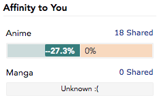
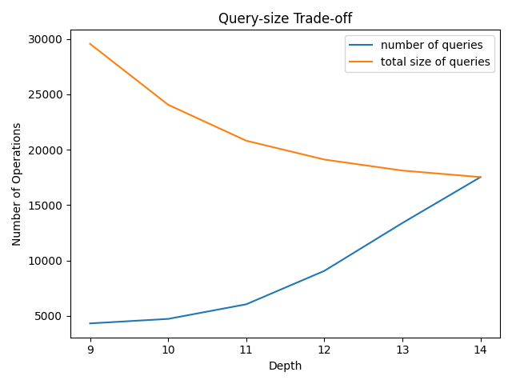

## _An Efficient Privacy Attack on MyAnimeList's Affinity Oracle_

**Abstract**: [MyAnimeList](https://myanimelist.net/) computes similarity
statistics (the number of shared anime and Pearson's correlation) between the
current user and another user, even if the other user's list is private. Can
this information be abused to discover the contents of the private list? The
answer is an definitive yes. The anime in a private list can be determined in
_O(M_ log _N)_ queries if _N_ is the number of anime in the entire database
and _M_ is the size of the list, and at worst _O(N)_ API operations. Once the
anime in a private list is determined, the scores the user rated each anime
can be computed in at most _M_ - 1 queries and _O(M)_ API operations. Thus,
it is computationally efficient and practical to determine the entirety of a
private list with only publicly accessible information.

Recommendations: Don't compute the number of shared anime or the
affinity for users who make their lists private. When sharing aggregate
user data for scientific purposes, consider looking into [differential
privacy](https://www.cis.upenn.edu/~aaroth/Papers/privacybook.pdf).

- [`attack.py`](./attack.py): an implementation of both parts of the attack.
- [`query.py`](./query.py): responds to queries posed by `attack.py`.
- [`gen_test_data.py`](./gen_test_data.py): generates the
database of possible anime and the particular private list.

Helper files:
- [`stats.py`](./stats.py): generates the tables and figures in this paper
- [`prob.py`](./prob.py): helper library for probabilistic analysis 

## Introduction

[MyAnimeList](https://myanimelist.net/) ("MAL") is a popular website for
keeping track of the anime one has watched. Lists are public by default, for
example, my list is available [here](https://myanimelist.net/profile/vazae)
and anyone can see what anime I've watched and what I've scored
them. Users can choose to make their lists private, for example this
[user](https://myanimelist.net/profile/affinity-oracle). Despite the
list being private, I can still view the number of shared anime and the
affinity compared to my list. 


_Figure 1_: The user `affinity-oracle` has a private list.



_Figure 2_: The number of shared anime and affinity
are still computed against the current user.

This paper demonstrates efficient ways to take
advantage of that statistical information.

Challenge: I've taken a score list and encoded
it into a string in the following manner:
```python
"".join(chr(10*l[i<<1] + l[i<<1 | 1] - 11) for i in range(len(l)>>1)).lower()
```
If you know each of the scores for the user `affinity-oracle`, simply go
through the anime in alphabetical order and append their scores to form
a list, then apply the above transformation to get a secret message*.

*Please don't abuse the MAL API! This can be done by hand, and if you
email me I'll provide the list of anime (the interesting part is the score
determination, which takes far less steps than the anime determination).

## Part 1: Determining List Contents

Suppose we have a set of _N_ possible anime (the universe of all
possible anime) and _M_ anime in the private list. We show how
to efficiently determine which anime are in the private list.

### Naive Algorithm

Suppose we want to know whether anime _i_ is in the private list. We can simply
add _i_ to our (initially empty) list and then check how many anime are shared.
If there is 1 anime shared we know _i_ is in the user's list and if there are
no anime shared we know _i_ isn't in the user's list. If we check this for each
possible anime, we have a simple _O(N)_ brute force algorithm.

At this time there appears to be only [17,500 total
anime](https://myanimelist.net/topanime.php?type=bypopularity&limit=17500)
which is certainly reasonable to brute force.

However, for very large _N_ we will consider an alternative
approach, based on the fact that the [average number of scored
anime per list](https://anime.plus/s/globals) is around 385,
significantly smaller than _N_.

### Binary Tree Algorithm

Construct an arbitrary binary tree on the possible anime, balanced such
that the depth is _O(log N)_. We start at the root node. When we query a
node, we ask whether any of its children are in the list by constructing a
MAL list of all the child anime and checking the number of shared anime.
If there is a non-zero overlap, the subtree rooted at this node contains
at least one anime in the private list, so we recur on its left and right
children. Otherwise, the subtree can be pruned.

We do exactly _M_ root to leaf paths, and we query each node along these
paths, so the total number of queries is the sum of the path lengths, _O(M_
log _N)_. However, the _size_ of each query (how many anime we must add to
the list) is at most _O(N_ log _N)_ via a merge sort-like analysis (at each
depth of the tree, the sum of the size of the queries add up to _N_, there
are log _N_ depths, so there are _N_ log _N_ anime in queries total). This is
again impractical if _N_ is large, so we might consider sorting by the most
popular anime to maximize the probability that we hit the private anime.

#### Query-size Tradeoff

A trick to optimize the size of the queries is to skip checking early nodes.
Since early nodes are highly likely to contain at least one anime, we can skip
checking them entirely and continue the search assuming they aren't pruned.
This will waste queries if done at too high of a depth (since we will have to
query both of the node's children when we could have just pruned the node), but
if done early it will actually _save_ queries since we skip extraneous queries
which would have told us to continue anyways. This depth parameter creates the
_query-size trade-off_, where increasing depth will increase the number of
queries, but will decrease the total size of the queries (at the extreme is
querying each possible anime once, degenerating into the naive algorithm).

For _N_ = 17,526 and _M_ = 385, 


_Figure 3_: Increasing depth exponentially increases the
number of queries while decreasing the total query sizes.

Inspired by the above query/size trade-off, we consider trying to minimize the
sum of the number of actions, assuming each action takes the same amount of
time (as long as we have a framework, we can weight actions by their actual
profiled times later). Our 3 actions are {check statistics, add anime to list,
remove anime from list}. For the naive strategy of querying exactly one anime
at a time to determine whether that anime is present in the other person's
list or not, on each query it must remove the previous anime, add in the new
anime, and check the stats page. This is 3 actions for _N_ queries, so 3*17,526
= 52,578 for the current size of the MAL database.

Would a certain depth beat this number? Note that our algorithm is written as
a depth-first-search tree search which nicely minimizes the transition cost
--- the algorithm will explore related queries so only the _difference_ in the
lists will be counted as "transition time".


_Figure 4_: There exists a global minimum because the cost function is convex.

A depth of 11 is optimal in this case. Also note that the number of additions
is nearly equal to the number of removals (since each thing added will be
eventually removed, barring the last addition; they have symmetry) and that the
number of additions (and the number of removals) will be less than the total
size for depths less than 14 because of the aforementioned DFS behavior.

### Empirical Results

To determine the real-world average performance of the above algorithms,
we generate 10^3 random lists of size 385 taken from a database of 17,526
possible anime. The binary tree algorithm with a depth of 11 uses an average
of **44,076.69** API calls, +/- 78.424 (standard deviation).

### Closing Notes

We are also able to upload XML files instead of adding/removing anime,
essentially doing a single query in one batch. Since we can edit the XML
file locally, it is likely more efficient than the adding/removing APIs
for a single anime if the query is large. In that case we want to minimize
the number of file uploads, which is equivalent to minimizing the number
of queries, done by depth 9. Whether XML files are uploaded or anime
added/removed individually can be determined by timing the operations.

In conclusion, the binary tree algorithm provides an efficient way to determine
the contents of a private list by providing a framework to trade-off between
the number of queries and their sizes. If the total number of anime is large
and the size of the private list relatively small, then minimizing queries
should be the priority. If the size of the private list is relatively large,
then minimizing the size of the queries is the major concern. Finally,
uploading XML provides an efficient mechanism for doing large queries, which
again puts a focus on minimizing queries.

## Part 2: Determining Scores

See the following
[LaTeX report](https://stephen-huan.github.io/assets/pdfs/cs-lectures/math/mal-affinity-attack/writeup.pdf)
for the technical details of the algorithm. 
A high-level summary is as follows:

[_Pearson's
correlation_](https://en.wikipedia.org/wiki/Pearson_correlation_coefficient)
is a way to measure the similarity between two vectors. If ***u*** and
***v*** are real vectors, Pearson's correlation is defined as follows:
first, center both vectors by taking the vector and subtracting its
mean from each element. Then, take both transformed vectors and compute
the cosine of the angle between them using the standard dot product
formula, ***u*** dot ***v*** over |***u***||***v***|.

Suppose ***u*** is the user's private list. We can only learn about
***u*** through knowing MAL's computed affinity (Pearson's correlation)
of ***u*** against a known vector ***v*** (our own list's scores). An
important implication is that we are unable to tell the difference between
***u*** and some transformation _a_***u*** + ***b*** for any positive
scalar _a_ and constant vector ***b*** because of the properties of
Pearson's correlation. As we will see, this isomorphism between **u**
and an affine transformation of **u** must be accounted for.

As stated previously, we can only gain information about ***u*** through its
correlation with some known vector ***v***. We carefully construct ***v***'s in
such a way that it is computationally efficient to compute ***u***, generating
a linear system with one free variable. This linear system has _M_ - 1 rows and
we will therefore use exactly _M_ - 1 queries. Each query requires two anime
to change scores, so the total number of API operations is exactly 2 _M_ - 2.
We now need to determine the particular _a_ and ***b*** that transforms our
computed ***u*** into the ground truth ***u*** (since our computed ***u*** may
be a transformation of the real score list for the aforementioned reasons).
Luckily, we have additional information that will help us narrow down the
possibilities: we know the real score list must have integer scores between
1 and 10. We take advantage of this by finding a list with integer scores
between 1 and 10 that is closest to our ***u*** with the help of a _canonical
form_ for the equivalence class generated by affine transformations. We then
generate all valid _a_ and ***b*** transformations of this _integer_ list
(since it is constrained to a finite number of possibilities). Finally, we
pick the possibility that is closest to the known private list mean:


_Figure 5_: For user with a private list, their mean score is public.

An important property of the mean is that if ***u*** has a mean of mu,
then _a_***u*** + ***b*** has a mean of _a_ mu + ***b***. This means it
is theoretically possible for two possibilities to have the same mean,
e.g. if _a_ and ***b*** make _a_***u*** + ***b*** have a mean of 2, then
we could engineer a new set of _a_ and ***b*** by setting _a_ to 2 _a_
and ***b*** to 2***b*** - 2 because 2*2 - 2 = 2.

An [early version](./archive/mle.md) of this paper used a more analyzable
approach to distinguish between possibilities, specifically a form of maximum
likelihood estimation, and tested it on a variety of distributions. As the
next section will show, knowing the sample mean is much stronger than knowing
the distribution.

### Empirical Results

To test the real-world performance of the score estimation algorithm, we
generate private lists of varying size, whose scores follow the [global MAL
distribution](https://anime.plus/s/globals). We then plot the probability
that the predicted list matches the private list exactly.


_Figure 6_: Score estimation performance on the MAL distribution. 

Ignoring a dip at 2, the algorithm has around a 100% chance of recreating the
private list until after about 200, in which case the accuracy steadily drops
as time goes on. Why should this be the case? [Recall](#introduction) that
we have only 3 digits for affinity (since it is a percentage with 1 decimal
point). This means as the list gets larger, the amount of precision per score
goes down, and we become unable to tell the difference between close scores.
This loss of precision motivates the next algorithm.

### Batching

To get around the loss of precision, we can simply split a large list into
smaller lists. The size of the smaller lists must be large enough such that the
mean can reliably pick the right solution out of the multiple possibilities.
The problem is that the sublists do not have the same mean as the entire
list, especially if the sublists are not random. If we go by the default
alphabetical order, then similar shows will be grouped near each other, and
the user will probably rate them similarly. This correlation problem can be
avoided if we simply shuffle the list before generating batches, so that each
score can be though of as identically and independently distributed (i.i.d.).
Even with shuffling, the performance for a particular size will be worse than
the graph shown in figure 6 since the population mean is only an approximation
for the sample mean. This creates the _multiplicity-precision trade-off_,
where increasing the batch size increases the chance of a unique solution
but decreases the precision of each score. An easy resolution is to choose a
size near the point at which precision starts degrading the performance. The
following graph shows a batch size of 128:


_Figure 7_: Batch algorithm performance.

The batch algorithm is the best of both worlds, able to scale to large lists
while maintaining a 100% accuracy --- even if a batch is wrong, the mistake is
localized to that particular batch. It has the exact same graph as figure 6
for list sizes less than the batch size, and there is nothing we can do about
the sub 100% accuracy for lists with less than 9 anime. Luckily MAL won't
even calculate affinity for lists that share less than around 10 anime, so
such situations aren't possible anyways (if the list has less than 10 anime,
we can't do anything). Ignoring the case of small lists, another edge case
is if the list is constant. In that case the list minus its mean yields the
zero vector, whose angle is ill-defined. When trying to calculate the cosine
similarity, we divide by |***u***| which is 0 and therefore the similarity
does not exist if one of the vectors is constant. We can still determine
the list exactly since we know the list is constant if MAL doesn't show an
affinity even when the number of shared anime is greater than 10, and once
we know the list is constant we know each score by looking at the mean.

### Closing Notes

The score estimation algorithm is much more practical than the anime
determination algorithm. We can do score estimation in exactly _M_ - 1
queries (with one batch) and each query is exactly two API operations to
change the scores of two anime. For larger lists where batching applies,
it actually uses less queries since we lose a query every batch, but adds
additional overhead in adding the anime for the current batch and removing
the anime from the previous batch. Each anime is added once and removed
once, so this adds an upper bound of 2 _M_ API operations. Thus, the entire
algorithm has a 4 _M_ API bound (2 _M_ change score operations, 2 _M_
add/remove anime operations). This is linear with respect to the length of
the private list, which is better than the anime determination algorithm
if the size of the private list is reasonable (_M_ less than 3/4 _N_).

## Practical Considerations

We have assumed that the set of API operations {"add anime to list",
"remove anime from list", "change score of anime", "check stats against
other user"} happen in constant time. This assumption is valid for the
first three operations since such operations are local to the user,
but we run into problems for the last operation. MAL does not update
these statistics immediately; it takes on the order of 20 minutes to
an hour for the database to update. This large delay may seem to ruin
our algorithms but we can take advantage of _parallelism_.

We first analyze the anime determination algorithm. The naive algorithm can
be trivially parallelized in the following manner: create an account for each
anime in the database and assign each account to exactly 1 anime. When trying
to determine the anime in a private list, have each account check against
the private list to see if there are 1 shared or 0 shared, directly telling
whether the anime is in the private list or not. Thus, all _N_ checks happen
in parallel. This "parallelism" is independent of _machine_ parallelism ---
the same machine can operate multiple accounts. We can also parallelize the
binary tree algorithm in a similar manner albeit with less efficiency gains.
At a certain depth of the tree we need to wait for the statistics check to
conclude before going onwards since we want to take advantage of subtree
pruning. We therefore parallelize nodes of the same _depth_. Since the depth
of the tree is _O(log N)_, the "depth" of the parallelization is also _O(log
N)_, so we have to wait for around 15 API calls to conclude, which for the
current size of the database takes around 5 hours.

The score estimation algorithm is trivially parallelizable since a linear
system is invariant to permutation. We know each query ahead of time, so we
can do the _M_ - 1 queries simultaneously and collate the results afterwards.

## Conclusion

If _N_ is the number of anime in the database and _M_ is the number of anime
in the private list, we can determine the anime in a private list with _O(M_
log _N)_ queries and at most 3 _N_ API operations. We can determine the score
of each anime with high probability for lists of any, possibly unknown, score
distribution and in at most _M - 1_ queries and 4 _M_ API operations. Thus,
we can determine a private list entirely with at most **3 _N_ + 4 _M_**
API operations. In the worst case when _M_ = _N_, this is 7 _N_ = ~120,000
operations for the current size of the database. For the average case of _M_
= 385, algorithmic improvements to both steps lower the number of operations
to around **45,000**, about 5/6th of the 54,118 predicted by the upper bound.
Thus, we have shown it is realistic to determine the contents of a private
list with only similarity statistics.

## Appendix

### _Table 1_: Query-Size Trade-off 

depth  | \# of queries | total size
-----: | :------------ | :---------
1-8    | worse than 9  | worse than 9
  9    |  4329         | 28696
 10    |  4685         | 23888
 11    |  6040         | 20789
 12    |  9036         | 19035
 13    | 13457         | 18118
 14    | 17526         | 17526

### _Table 2_: API Calls

depth  | operations
-----: | :---------
  9    | 51025 
 10    | 45975
 11    | 44077
 12    | 45412
 13    | 48854 
 14    | 52576 

### _Table 3_: Score Estimation Performance on MAL's Global Distribution 

_M_   | % identical | batched
----: | :---------: | :-----:
   1  | 1.000       | 1.000
   2  | 0.643       | 0.643
   3  | 0.869       | 0.869
   4  | 0.954       | 0.954
   5  | 0.985       | 0.985
   6  | 0.993       | 0.993
   7  | 0.997       | 0.997
   8  | 0.999       | 0.999
   9  | 1.000       | 1.000
  10  | 1.000       | 1.000
  20  | 1.000       | 1.000
  30  | 1.000       | 1.000
  40  | 1.000       | 1.000
  50  | 1.000       | 1.000
  60  | 1.000       | 1.000
  70  | 1.000       | 1.000
  80  | 1.000       | 1.000
  90  | 1.000       | 1.000
 100  | 1.000       | 1.000
 200  | 1.000       | 1.000
 300  | 0.959       | 1.000
 400  | 0.903       | 1.000
 500  | 0.620       | 1.000
 600  | 0.432       | 1.000
 700  | 0.300       | 1.000
 800  | 0.240       | 1.000
 900  | 0.182       | 1.000

