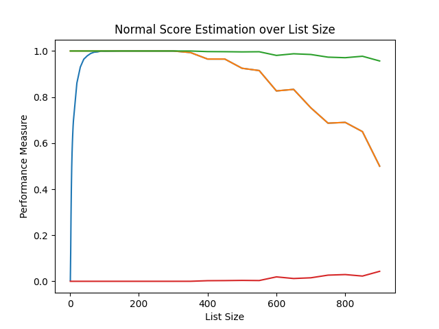
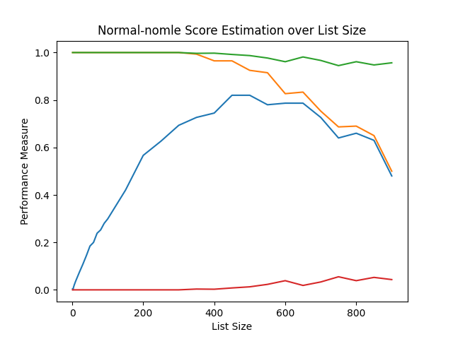
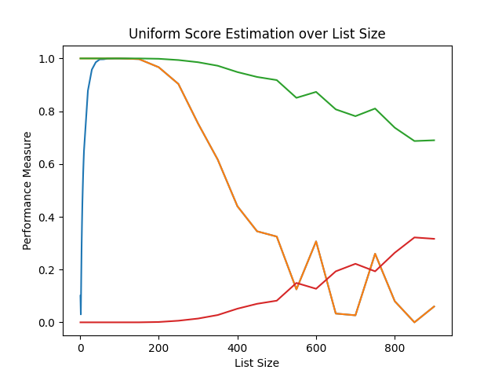
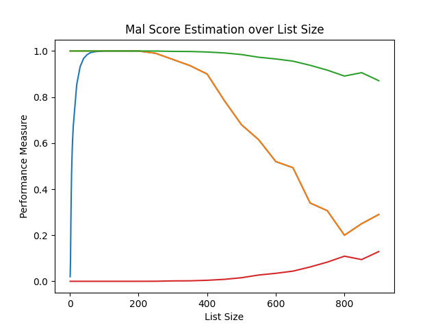
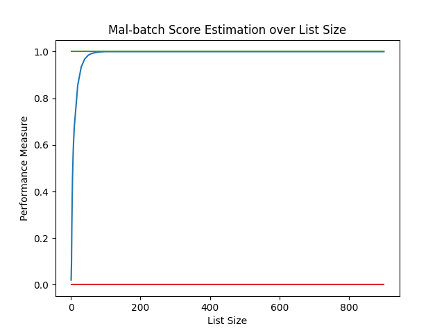

## Determining Scores

See the following [LaTeX report]() for the technical details of the algorithm. 
A high-level summary is as follows:

[_Pearson's
correlation_](https://en.wikipedia.org/wiki/Pearson_correlation_coefficient)
is a way to measure the similarity between two vectors. If ***u*** and
***v*** are real vectors, Pearson's correlation is defined as follows:
first, center both vectors by taking the vector and subtracting its
mean from each element. Then, take both transformed vectors and compute
the cosine of the angle between them using the standard dot product
formula, ***u*** dot ***v*** over |***u***||***v***|.

Suppose ***u*** is the user's private list. We can only learn about ***u***
through knowing MAL's computed affinity (Pearson's correlation) of ***u***
against a known vector ***v*** (our own list's scores). An important
implication is that we are unable to tell the difference between ***u*** and
some transformation _a_***u*** + ***b*** for any positive scalar _a_ and
constant vector ***b*** because of the properties of Pearson's correlation.
As we will see, this isomorphism between **u** and an affine transformation
of **u** will have profound implications for our algorithm. 

As stated previously, we can only gain information about ***u*** through its
correlation with some known vector ***v***. We carefully construct ***v***'s in
such a way that it is computationally efficient to compute ***u***, generating
a linear system with one free variable. This linear system has _M_ - 1 rows
and we will therefore use exactly _M_ - 1 queries. We now need to determine
the particular _a_ and ***b*** that transforms our computed ***u*** into the
ground truth ***u*** (since our computed ***u*** may be a transformation
of the real score list for the aforementioned reasons). Luckily, we have
additional information that will help us narrow down the possibilities: we
know the real score list must have integer scores between 1 and 10. We take
advantage of this by finding a list with integer scores between 1 and 10
that is closest to our ***u*** with the help of a _canonical form_ for the
equivalence class generated by affine transformations. We then generate all
valid _a_ and ***b*** transformations of this _integer_ list (since that
constraints _a_ and ***b*** to a finite number of possibilities). Finally, we
pick the possibility that has the maximum probability of being generated from
our prior distribution --- our hypothesis for how the scores are distributed,
a rational pick is the [global MAL distribution](https://anime.plus/s/globals)
but any distribution on the values 1--10 can be used. This technique is called
_maximum likelihood estimation_ (MLE) since it maximizes the likelihood of
the data being generated.

### Detailed Analysis

The following graphs show the score estimation algorithm applied to a uniform
distribution, (1/10 probability for each score), normal distribution (mean of
5.5 and standard deviation of 1.5), and MAL's distribution. The x-axis shows
increasing private list size. Blue shows the probability that the guessed
list exactly matches the actual list, orange shows the probability that they
are equivalent from the perspective of Pearson's correlation, green shows the
percentage of scores that match, and red shows the average score difference
between the two lists. 

blue - identical, orange - correlation identical | green - % correct, red - average difference
:----------------------------------------------: | :-----------------------------------------:
   | 
 | 

_Figures 1--4_: Score estimation performance on various distributions. MLE is used unless otherwise indicated.

An important observation is that as the size of the list increases, the
chance of being exactly right goes up from 0--100, stabilizes at around 100%
for 100-200, and then starts going down around 300 for each distribution.
This is accompanied by a decrease in the chance of being equivalent, a
decrease in the percentage of scores that match, and an increase in the
average score difference. The reason for the global decline in quality from
300 onwards is because we have limited precision --- MAL only reports 3
digits of affinity (a signed percentage with one decimal point). Because of
this precision limitation, larger lists will use up more precision so it
becomes impossible to tell apart close values. This is also why the uniform
distribution degrades faster than the normal and MAL distributions, because
the uniform distribution has a higher variance and therefore consumes more
precision compared the closer together distributions.

The reason the chance of being exactly right goes _up_ early on is because of
the need to choose between equivalent score lists --- MLE is an algorithm to
try to maximize the chance we pick the right list, but it cannot guarantee
anything. If the score list has a 1 and a 10, then there can't be a constant
shifting since shifting will move the scores out of the proper range*. The list
being larger will therefore increase the chance that there's a unique solution
since the list will have a higher chance to contain 1's and 10's the larger it
is. However, once the list is too large, we lose precision and therefore our
guess becomes simply incorrect. This is the _multiplicity-precision trade-off_,
and the graph gives a clear resolution - the size of the list should be around
100-200 to maximize the chance of being exactly correct.

*This is not quite right but we will have a more
specific analysis [later](#determining-uniqueness).

Finally, the graphs underscore the importance of MLE. The top left graph is
a normal distribution with MLE, while the top right graph is without MLE.
Note how the orange lines are identical (because MLE only picks between valid
solutions, it won't make a valid solution invalid or vice versa) while the blue
lines are significantly different. A normal distribution with a mean of 5.5 and
a standard deviation of 1.5 means 1 and 10 are 3 standard deviations, a very
low 0.3% chance of occurring. Thus, it is unlikely to have a unique solution
and MLE is very effective in filtering between the possible solutions.

### Determining Uniqueness

We spent a lot of time focusing on MLE, but it is just one of
many ways of determining _uniqueness_, or finding a particular
_a_ and ***b***. We now systematically analyze all avenues.
- Each element in the result must be integer, between 1 and 10
- If the minimum is not 1 or the maximum not 10, then the problem is impossible
without additional information: we can shift up/down, e.g. if the minimum is
3 we can subtract 2 from each element. Even if the min is 1 and max is 10,
that's not enough because we can still scale. If the list is (1, 10), then we
can divide by 3 and add 2/3. 1/3 + 2/3 = 1, 10/3 + 2/3 = 4, so our new list is
(1, 4) which is valid. This works because we can divide by 3, and we can divide
by 3 because the difference between 1 and 10 (10 - 1 = 9) is divisible by 3.
If we can divide by 3 (or 9), then it is possible to pick ***b*** such that
the result is integer again. Therefore for there to be an unique solution, the
min has to be 1, the max 10, and at least one pairwise difference between any
two scores must not be divisible by 3. In such a situation there is a unique
solution for _a_ and ***b***, otherwise there are multiple solutions.
- If we knew the standard deviation, we would have a unique solution
for _a_. This follows from the fact that scaling a vector by a
positive factor _a_ scales the standard deviation by the same factor:
```
Var[aX + b] = a^2 Var[X] (can easily be proved from def. Var)
Std[aX + b] = sqrt(Var[aX + b]) = sqrt(a^2 Var[X]) = a Std[X]
```
Thus, if the standard deviation of the private list is sigma and the standard
deviation of our ***u*** is sigma_u, then _a_ must be sigma/sigma_u so that
_a_***u*** + ***b*** has the same standard deviation as the ground truth. We
can then determine ***b*** from the integer constraint: we know that there must
be some integer solution since there exists the private list, which means that
there must be some ***b*** that added to _a_***u*** will make every value in
_a_***u*** integer. We can simply pick any fractional part of _a_***u*** (or
average fractional parts for numerical stability), set ***b*** to the negative
of that fractional part, and then round. Of course, ***b*** is still not fully
constrained; if the min is 1 and max is 10 then it will be, otherwise we can
still arbitrarily shift ***b***.
- If we knew the mean, it does not necessarily constrain
the solution. Doing a similar analysis to variance,
```
E[aX + b] = a E[X] + b
```
This is dependent on both _a_ and ***b*** so we do not have an
easy solving process. And it is possible for different _a_ and
***b*** to yield the same mean, e.g. a mean of 2 for some _a_
and ***b*** could be attained also by multiplying both _a_ and
***b*** by 2 and then adding -2 to ***b*** since 2*2 - 2 = 2.

If we set the mean after two different transformations equal to each other,
```
a1 mu + b1 = a2 mu + b2
mu = (b2 - b1)/(a1 - a2)
```
which means the mean must be some fraction. We know that _a_ and ***b*** are
integer, so this must be an fraction with denominator 1--9. I guess it's unlikely
for the mean to be very close to a fraction by accident? To be honest, I don't
have much insight into why knowing the mean is such a strong forcing, but it
works very well (which is why this section is relegated to the archive).
- If we knew the mean _and_ the standard deviation, we would have a unique
solution. The standard deviation uniquely determines _a_ and then ***b*** is
determined by the mean: _a_ E[_X_] + ***b*** = mu, ***b*** = mu - _a_ E[_X_]
- If we knew two distinct scores (e.g. through reviews, MAL will show what
score a reviewer gave an anime) then we could solve for _a_ and ***b*** with
a simple linear system: Suppose we know the scores ***u***1 and ***u***2 and
their correspondence in our current guess ***v***1 and ***v***2:
```
 v = a u + b

  v1 = a u1 + b
- v2 = a u2 + b
---------------
v1 - v2 = a(u1 - u2)
a = (v1 - v2)/(u1 - u2)
using the first equation,
b = v1 - a u1
```
See [query.py](https://github.com/stephen-huan/MAL-affinity-attack/blob/2946354174cadc6f27bf4288fd69915415ffd3b6/query.py#L55-L69)
for an implementation of this idea.

### Batching

Recall the _multiplicity-precision trade-off_, where increasing the size of
the list increases the chance we'll get a unique solution, but decreases the
precision available to us. We can get the best of both worlds if we split a
large list into _batches_ and solve each batch independently. The important
parameter is now _batch size_, or the largest a batch can be. If the batch size
is too small, then we won't get a unique solution and we'll have to guess. If
we guess wrong, then merging two batches will yield a final list that is not
even equivalent with respect to Pearson's correlation (much less identical).
Meanwhile if our batches are too large, we lose too much precision. A safe pick
is a list size with accuracy around 100%, and a list with half the size also
with high accuracy (since if the batch size is the largest a batch can be, then
then the worst case is a list of size batch size + 1. In that case we split
the list in half, so the smaller of the two halves is half the batch size).

Safe picks appear to be around 128--256, 128 is chosen by default.



_Figure 5_: Batch algorithm performance.

With the batch algorithm any list size past ~60 will have nearly a 100%
accuracy. Even for very large lists, if one of our batches happens to be
wrong because of uniqueness, it only locally affects that batch. Therefore
the error rate is at worst the rate of half the batch size, and for large
lists the error rate will be the error of the batch size.

## Appendix

Batch size behavior: Suppose the size of the list is _M_. Then the best case
(to maximize the size of each batch while staying under the batch size) is
if _M_ is a mulitple of the batch size _n_, since each batch's size will be
the batch size, the largest it can be. The worst case is if _M_ = _k n_ + 1,
i.e. _M_ is one more than a mulitple of the batch size because that forces a
new batch, making each batch smaller. The size of each batch will be (_k n_ +
1)/(_k_ + 1) = _k_/(_k_ + 1) _n_ + 1/(_k_ + 1). The smallest this gets is if
_k_ = 1, in which case the smaller batch will be half the size of the batch
size. Thus, we must pick _n_ such that _n_ and _n/2_ have a high accuracy.

### _Tables 1--5_: Score Estimation Performance on Various Distributions

#### _Table 1_: Normal distribution (without maximum likelihood estimation)

_M_   | exactly correct | mathematically correct | % correct | average error
----: | :-------------- | :--------------------- | :-------- | :------------
   1  | 0.004           | 1.000                  | 100.0     | 0.000
   2  | 0.000           | 1.000                  | 100.0     | 0.000
   3  | 0.007           | 1.000                  | 100.0     | 0.000
   4  | 0.013           | 1.000                  | 100.0     | 0.000
   5  | 0.017           | 1.000                  | 100.0     | 0.000
   6  | 0.022           | 1.000                  | 100.0     | 0.000
   7  | 0.026           | 1.000                  | 100.0     | 0.000
   8  | 0.030           | 1.000                  | 100.0     | 0.000
   9  | 0.034           | 1.000                  | 100.0     | 0.000
  10  | 0.038           | 1.000                  | 100.0     | 0.000
  20  | 0.074           | 1.000                  | 100.0     | 0.000
  30  | 0.108           | 1.000                  | 100.0     | 0.000
  40  | 0.145           | 1.000                  | 100.0     | 0.000
  50  | 0.185           | 1.000                  | 100.0     | 0.000
  60  | 0.200           | 1.000                  | 100.0     | 0.000
  70  | 0.238           | 1.000                  | 100.0     | 0.000
  80  | 0.253           | 1.000                  | 100.0     | 0.000
  90  | 0.280           | 1.000                  | 100.0     | 0.000
 100  | 0.299           | 1.000                  | 100.0     | 0.000
 200  | 0.523           | 1.000                  | 100.0     | 0.000
 300  | 0.620           | 1.000                  | 100.0     | 0.000
 400  | 0.694           | 0.986                  | 100.0     | 0.000
 500  | 0.720           | 0.920                  |  98.7     | 0.013
 600  | 0.865           | 0.946                  |  99.2     | 0.008
 700  | 0.733           | 0.800                  |  89.1     | 0.109
 800  | 0.600           | 0.600                  |  97.8     | 0.022
 900  | 0.682           | 0.682                  |  97.7     | 0.023

#### _Table 2_: Normal distribution (with MLE)

_M_   | exactly correct | mathematically correct | % correct | average error
----: | :-------------- | :--------------------- | :-------- | :-----------
   1  | 0.004           | 1.000                  | 100.0     | 0.000
   2  | 0.124           | 1.000                  | 100.0     | 0.000
   3  | 0.288           | 1.000                  | 100.0     | 0.000
   4  | 0.408           | 1.000                  | 100.0     | 0.000
   5  | 0.495           | 1.000                  | 100.0     | 0.000
   6  | 0.557           | 1.000                  | 100.0     | 0.000
   7  | 0.603           | 1.000                  | 100.0     | 0.000
   8  | 0.640           | 1.000                  | 100.0     | 0.000
   9  | 0.673           | 1.000                  | 100.0     | 0.000
  10  | 0.697           | 1.000                  | 100.0     | 0.000
  20  | 0.861           | 1.000                  | 100.0     | 0.000
  30  | 0.930           | 1.000                  | 100.0     | 0.000
  40  | 0.964           | 1.000                  | 100.0     | 0.000
  50  | 0.979           | 1.000                  | 100.0     | 0.000
  60  | 0.989           | 1.000                  | 100.0     | 0.000
  70  | 0.995           | 1.000                  | 100.0     | 0.000
  80  | 0.996           | 1.000                  | 100.0     | 0.000
  90  | 1.000           | 1.000                  | 100.0     | 0.000
 100  | 0.999           | 1.000                  | 100.0     | 0.000
 200  | 1.000           | 1.000                  | 100.0     | 0.000
 300  | 1.000           | 1.000                  | 100.0     | 0.000
 400  | 0.986           | 0.986                  | 100.0     | 0.000
 500  | 0.920           | 0.920                  |  98.7     | 0.013
 600  | 0.946           | 0.946                  |  99.2     | 0.008
 700  | 0.800           | 0.800                  |  99.1     | 0.009
 800  | 0.600           | 0.600                  |  97.8     | 0.022
 900  | 0.682           | 0.682                  |  97.7     | 0.023

#### _Table 3_: Uniform distribution

_M_   | exactly correct | mathematically correct | % correct | average error
----: | :-------------- | :--------------------- | :-------- | :------------
   1  | 0.101           | 1.000                  | 100.0     | 0.000
   2  | 0.030           | 1.000                  | 100.0     | 0.000
   3  | 0.170           | 1.000                  | 100.0     | 0.000
   4  | 0.290           | 1.000                  | 100.0     | 0.000
   5  | 0.379           | 1.000                  | 100.0     | 0.000
   6  | 0.454           | 1.000                  | 100.0     | 0.000
   7  | 0.513           | 1.000                  | 100.0     | 0.000
   8  | 0.567           | 1.000                  | 100.0     | 0.000
   9  | 0.610           | 1.000                  | 100.0     | 0.000
  10  | 0.650           | 1.000                  | 100.0     | 0.000
  20  | 0.878           | 1.000                  | 100.0     | 0.000
  30  | 0.958           | 1.000                  | 100.0     | 0.000
  40  | 0.986           | 1.000                  | 100.0     | 0.000
  50  | 0.996           | 1.000                  | 100.0     | 0.000
  60  | 0.997           | 1.000                  | 100.0     | 0.000
  70  | 0.999           | 1.000                  | 100.0     | 0.000
  80  | 1.000           | 1.000                  | 100.0     | 0.000
  90  | 1.000           | 1.000                  | 100.0     | 0.000
 100  | 1.000           | 1.000                  | 100.0     | 0.000
 200  | 0.973           | 0.973                  |  99.8     | 0.002
 300  | 0.744           | 0.744                  |  98.4     | 0.016
 400  | 0.431           | 0.431                  |  93.8     | 0.062
 500  | 0.320           | 0.320                  |  92.8     | 0.072
 600  | 0.270           | 0.270                  |  85.1     | 0.149
 700  | 0.067           | 0.067                  |  76.4     | 0.237
 800  | 0.080           | 0.080                  |  72.8     | 0.278
 900  | 0.136           | 0.136                  |  69.3     | 0.318

#### _Table 4_: MAL's global distribution

_M_   | exactly correct | mathematically correct | % correct | average error
----: | :-------------- | :--------------------- | :-------- | :------------
   1  | 0.020           | 1.000                  | 100.0     | 0.000
   2  | 0.091           | 1.000                  | 100.0     | 0.000
   3  | 0.251           | 1.000                  | 100.0     | 0.000
   4  | 0.371           | 1.000                  | 100.0     | 0.000
   5  | 0.460           | 1.000                  | 100.0     | 0.000
   6  | 0.521           | 1.000                  | 100.0     | 0.000
   7  | 0.573           | 1.000                  | 100.0     | 0.000
   8  | 0.614           | 1.000                  | 100.0     | 0.000
   9  | 0.644           | 1.000                  | 100.0     | 0.000
  10  | 0.673           | 1.000                  | 100.0     | 0.000
  20  | 0.854           | 1.000                  | 100.0     | 0.000
  30  | 0.932           | 1.000                  | 100.0     | 0.000
  40  | 0.967           | 1.000                  | 100.0     | 0.000
  50  | 0.984           | 1.000                  | 100.0     | 0.000
  60  | 0.993           | 1.000                  | 100.0     | 0.000
  70  | 0.996           | 1.000                  | 100.0     | 0.000
  80  | 0.998           | 1.000                  | 100.0     | 0.000
  90  | 0.998           | 1.000                  | 100.0     | 0.000
 100  | 1.000           | 1.000                  | 100.0     | 0.000
 200  | 1.000           | 1.000                  | 100.0     | 0.000
 300  | 0.967           | 0.967                  | 100.0     | 0.000
 400  | 0.875           | 0.875                  |  99.8     | 0.002
 500  | 0.700           | 0.700                  |  98.1     | 0.019
 600  | 0.622           | 0.622                  |  95.5     | 0.045
 700  | 0.333           | 0.333                  |  94.5     | 0.055
 800  | 0.240           | 0.240                  |  89.6     | 0.104
 900  | 0.227           | 0.227                  |  90.8     | 0.092

#### _Table 5_: MAL distribution with batching

_M_   | exactly correct | mathematically correct | % correct | average error
----: | :-------------- | :--------------------- | :-------- | :------------
   1  | 0.020           | 1.000                  | 100.0     | 0.000
   2  | 0.091           | 1.000                  | 100.0     | 0.000
   3  | 0.251           | 1.000                  | 100.0     | 0.000
   4  | 0.371           | 1.000                  | 100.0     | 0.000
   5  | 0.460           | 1.000                  | 100.0     | 0.000
   6  | 0.521           | 1.000                  | 100.0     | 0.000
   7  | 0.573           | 1.000                  | 100.0     | 0.000
   8  | 0.614           | 1.000                  | 100.0     | 0.000
   9  | 0.644           | 1.000                  | 100.0     | 0.000
  10  | 0.675           | 1.000                  | 100.0     | 0.000
  20  | 0.856           | 1.000                  | 100.0     | 0.000
  30  | 0.934           | 1.000                  | 100.0     | 0.000
  40  | 0.968           | 1.000                  | 100.0     | 0.000
  50  | 0.984           | 1.000                  | 100.0     | 0.000
  60  | 0.992           | 1.000                  | 100.0     | 0.000
  70  | 0.996           | 1.000                  | 100.0     | 0.000
  80  | 0.998           | 1.000                  | 100.0     | 0.000
  90  | 0.999           | 1.000                  | 100.0     | 0.000
 100  | 1.000           | 1.000                  | 100.0     | 0.000
 200  | 1.000           | 1.000                  | 100.0     | 0.000
 300  | 1.000           | 1.000                  | 100.0     | 0.000
 400  | 1.000           | 1.000                  | 100.0     | 0.000
 500  | 1.000           | 1.000                  | 100.0     | 0.000
 600  | 1.000           | 1.000                  | 100.0     | 0.000
 700  | 1.000           | 1.000                  | 100.0     | 0.000
 800  | 1.000           | 1.000                  | 100.0     | 0.000
 900  | 1.000           | 1.000                  | 100.0     | 0.000

